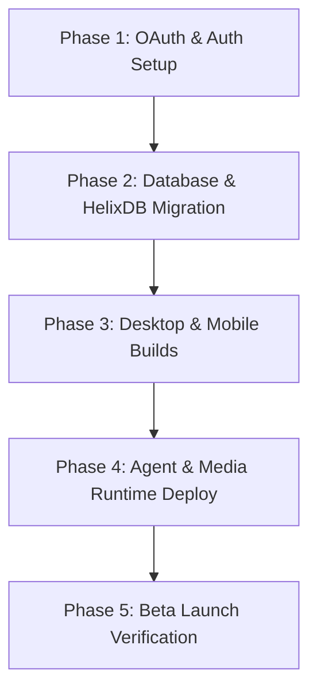

# 🗺️ HGI V6 Gap Analysis & Execution Roadmap

This document outlines the architectural and functional gaps identified during the system audit and defines a step-by-step roadmap to achieve Beta Launch readiness.

---

## 🔍 V6 Gap Analysis

### 1. Authentication & Founder RBAC
- **Gap:** PassportJS strategies for Google (`passport-google-oauth20`) and GitHub (`passport-github2`) are completely missing from the NestJS API controllers (`apps/api`), resulting in `404 Not Found` errors when attempting OAuth.
- **Impact:** Critical blocker for the public/private Beta. Email/password authentication is the only working path.
- **RBAC Status:** Proper founder RBAC checks are currently bypassed globally via `BETA_TEST_MODE`, which assigns the "founder" role to all registered accounts.

### 2. Desktop Application Builds
- **Gap:** Although Electron v6.0.4 DMG installers (`RE-EVOLVE ON HGI-6.0.4-arm64.dmg`) have been compiled locally in `apps/desktop/dist/`, they have not been pushed to the production distribution endpoints (e.g. S3/Railway assets) or verified in `/Applications`.
- **Impact:** High. Standalone desktop experience is not accessible to external beta testers.

### 3. Agent Civilization & Web Intelligence
- **Gap:** The 24-agent marketplace templates are fully typed and registered in [marketplace-registry.ts](file:///Users/nextunicorn/packages/agents/src/marketplace/marketplace-registry.ts), but their active runtime dependencies (Python 3.11 for `browser-use`, Rust compiler for `spider_mcp`, P2P Hyper DHT for `altersend-hgi`) are not deployed in the production environment.
- **Impact:** Medium. Marketplace agents remain "blueprints" or "partials" instead of fully functional autonomous tools.

### 4. Knowledge Universe & Memory API
- **Gap:** The Obsidian knowledge vault is populated, but programmatic memory traversal via **HelixDB** remains a partial integration. The HelixDB container is not active in production, preventing vector-graph querying.
- **Impact:** High. Programmatic cognitive feedback loops are limited to standard SQL memory.

### 5. Media & Creative Intelligence
- **Gap:** Video rendering compositions (e.g. `pitch-deck`, `founder-intro`) are coded in `packages/agents/src/marketplace/remotion-video-engine.ts` but lack an active AWS Lambda and S3 bucket deployment.
- **Impact:** Medium. Programmatic video synthesis is non-functional.

---

## 🚀 Execution Roadmap

### Phase 1: OAuth Implementation & RBAC Hardening (Days 1–2)
1. **NestJS Google Strategy:** Install and configure `passport-google-oauth20` in `apps/api`. Add the `/auth/google` and `/auth/google/callback` endpoints.
2. **NestJS GitHub Strategy:** Install and configure `passport-github2` in `apps/api`. Add the `/auth/github` and `/auth/github/callback` endpoints.
3. **Frontend Integration:** Connect the "Continue with Google" and "Continue with GitHub" buttons on the landing page/login.
4. **Harden RBAC:** Disable `BETA_TEST_MODE` and implement proper check guards inside `withRBAC` using database records.

### Phase 2: Database Migration & HelixDB Activation (Days 3–4)
1. **Schema Cutover:** Migrate PostgreSQL test data from `hgi_v5` to `hgi_v6` production tables.
2. **HelixDB Deployment:** Run the HelixDB Docker container on port `6969` in production and configure environment variable `HELIX_PORT`.
3. **Sync Logs:** Automate vault-to-database syncing via `hgi-sync.log` and verify the memory feedback loop.

### Phase 3: Desktop and Mobile Distribution (Days 5–6)
1. **Desktop Deployment:** Compile final Electron builds for macOS (ARM/Intel) and Windows, and host the installation binaries on a public download page (`beta.re-evolveon.com`).
2. **Mobile Build:** Verify the React Native TestFlight and Google Play Console distribution pipelines.

### Phase 4: Agent Runtimes & Media Engine Serving (Days 7–8)
1. **Python/Rust Agent Serving:** Deploy containerized runtimes for `browser-use` (browser-automation agent) and `spider` (crawler tools).
2. **Remotion Rendering:** Deploy the Remotion AWS Lambda function and S3 bucket triggers for programmatic video generation.
3. **API Keys Integration:** Inject remaining NVIDIA, ElevenLabs, and Higgsfield API keys into the production environment.

### Phase 5: Beta Rollout & Verification (Day 9)
1. **Onboarding verification:** Test the Invite Gate code (`AR-019WELCOMECREATOR`) and verify founder registration.
2. **End-to-End Walkthrough:** Run automated SRE chaos tests using `SanjeevaniX` to verify high-availability.

---
*[[../../VAULT-INDEX|← Home]]*
*[[../INDEX|← Foundation Index]]*
